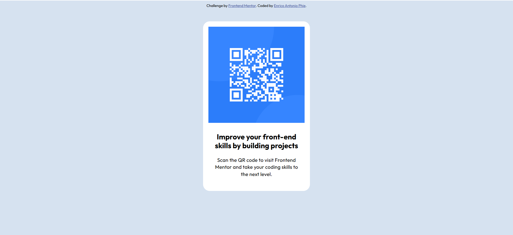

# Frontend Mentor - QR code component solution

This is a solution to the [QR code component challenge on Frontend Mentor](https://www.frontendmentor.io/challenges/qr-code-component-iux_sIO_H). Frontend Mentor challenges help you improve your coding skills by building realistic projects.

## Table of contents

- [Overview](#overview)
  - [Screenshot](#screenshot)
- [My process](#my-process)
  - [Built with](#built-with)
  - [What I learned](#what-i-learned)
  - [Continued development](#continued-development)
  - [Useful resources](#useful-resources)
- [Author](#author)

## Overview

### Screenshot



## My process

### Built with

- Semantic HTML5 markup
- CSS custom properties
- Flexbox

### What I learned

From this challenge, I just learned about css properties of :root. In root, we can specify global variables that accessible in the entire css file that makes the styling more controlable and we can reuse one variable instead of made the same style over and over.

Example of how to make css global variable and how to use it

```html
<h1 class="title-text">Some HTML code I'm proud of</h1>
```

```css
:root {
  --text-color: #1d1d1d;
}

.title-text {
  color: var(--text-color);
}
```

### Useful Resources

css root properties: https://developer.mozilla.org/en-US/docs/Web/CSS/:root

## Author

- Website - [Enrico Antonio Phie](coming soon)
- Frontend Mentor - [@ricophie03](https://www.frontendmentor.io/profile/ricophie03)
